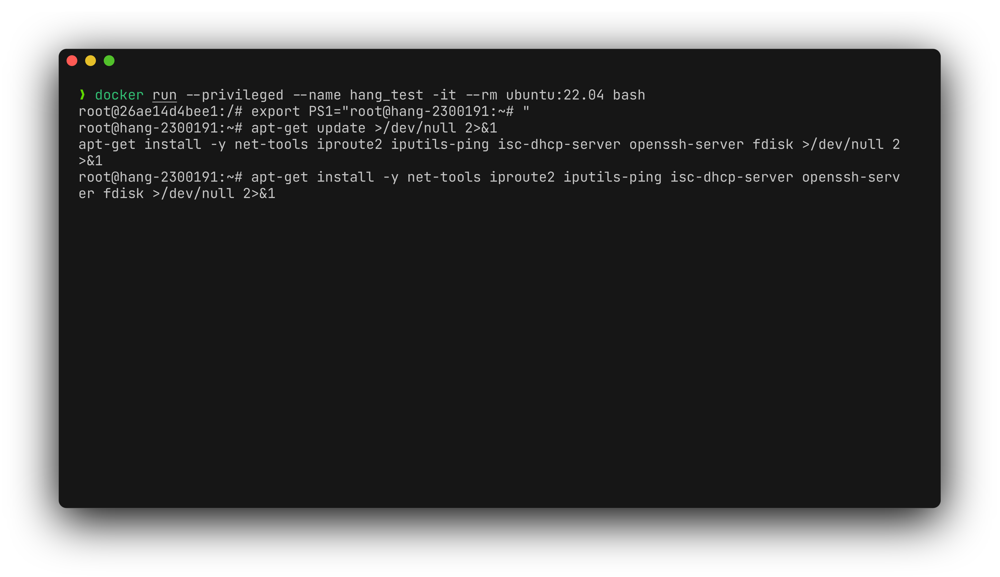
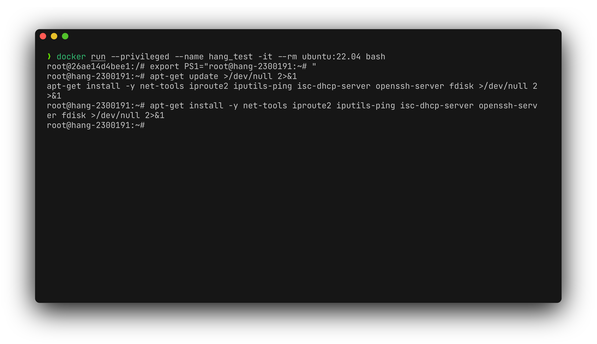
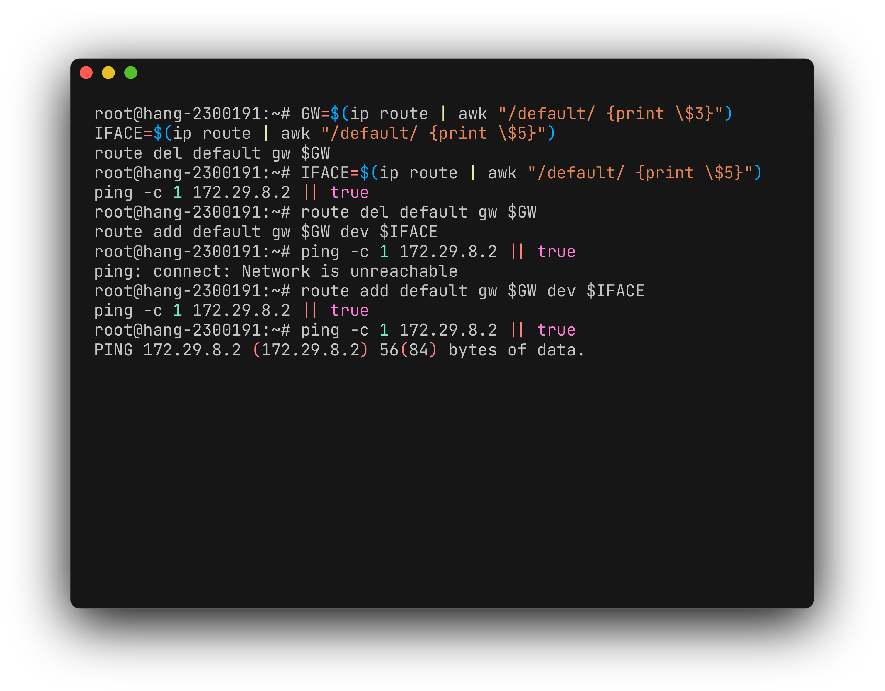
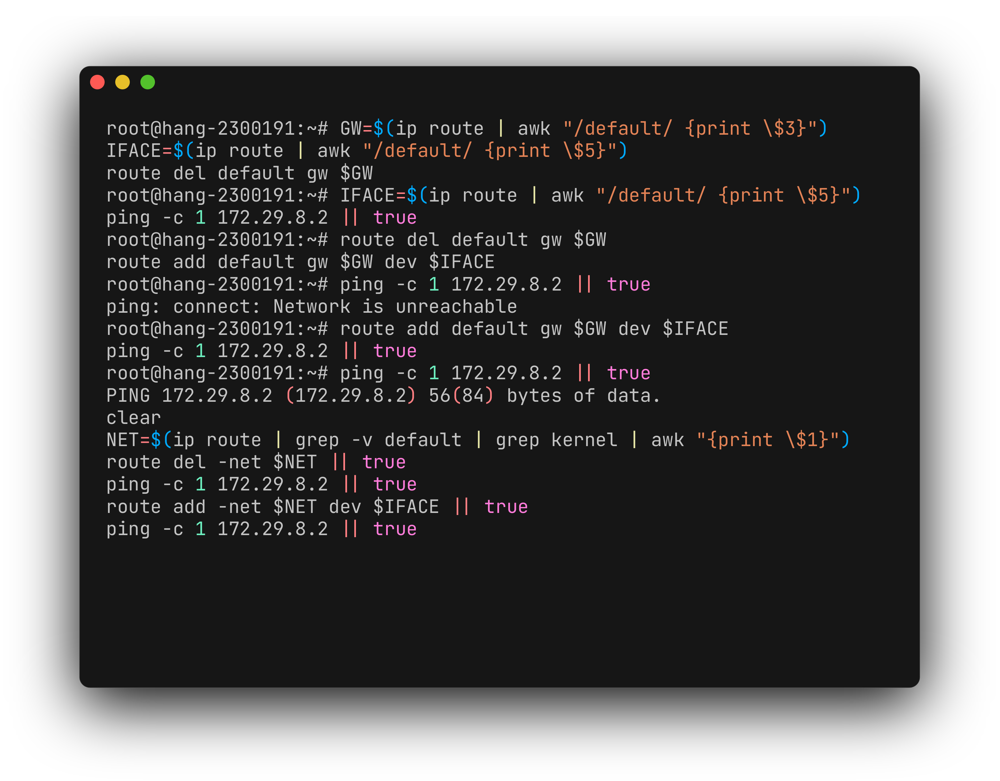
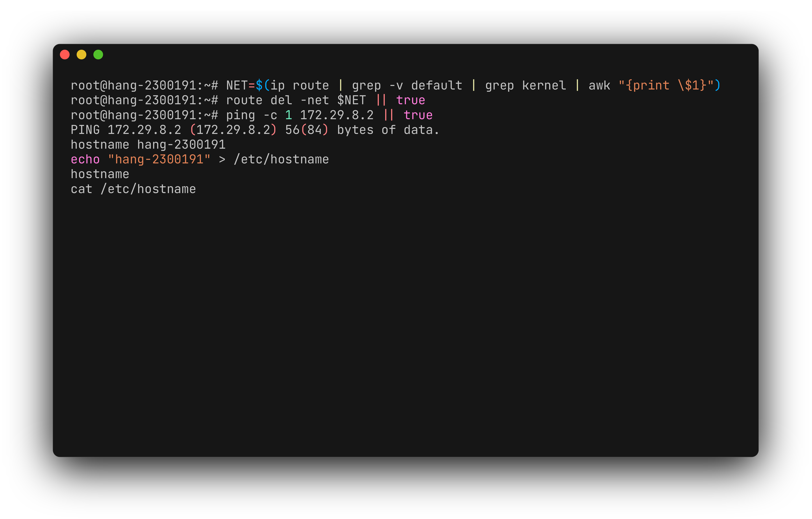
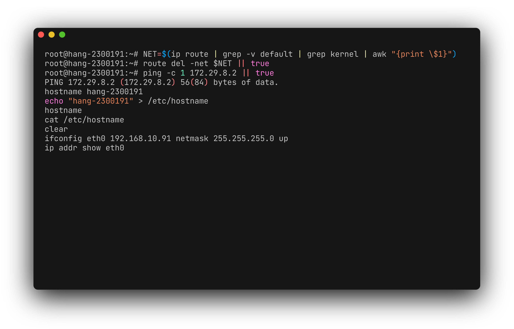
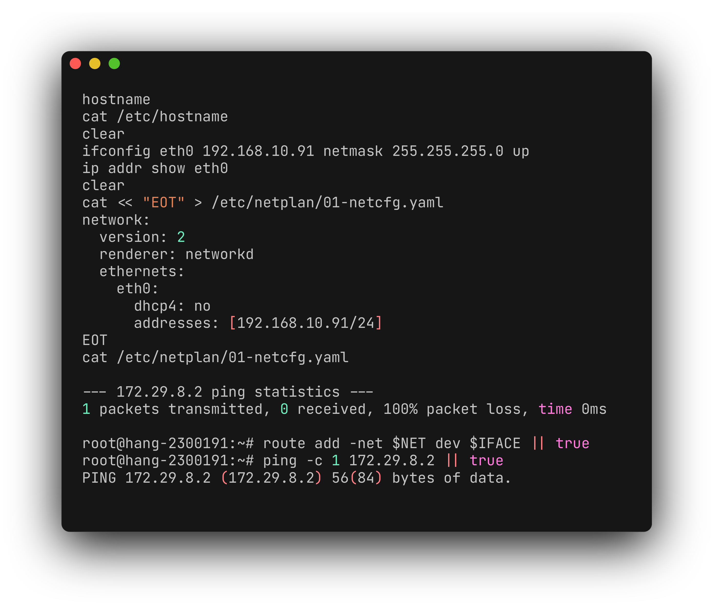
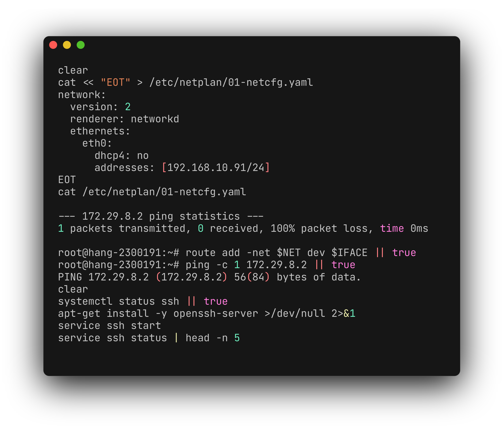
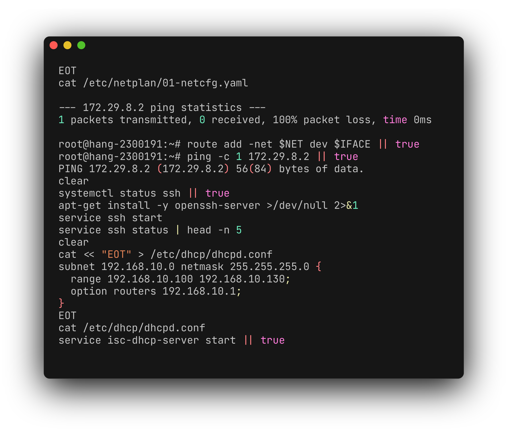

<div align="center">

# Bài cuối kỳ Linux ngày 29/06

**Lời giải bài cuối kỳ**

| Họ và tên | Mã sinh viên |
| --- | --- |
| Nguyễn Thị Thanh Hằng | 2300191 |

</div>

## Cấu trúc thư mục

```text
.
├── README.md
├── assets/
├── diagrams/
│   └── bai_cuoi_ky_hang_flow.puml
├── scripts/
│   └── bai_cuoi_ky_hang.sh
└── tests/
    └── run_tests.sh
```

## Câu 1 (1 điểm)

Chia đĩa thành các phân vùng `/`, `/var`, `/usr`, `swap`, `/home`.




## Câu 2 (1 điểm)

Xem bảng routing bằng `route -n` và `ip route`, lưu kết quả vào `/root/routing`.


## Câu 3 (1 điểm)

Tìm tập tin lệnh `ping`, rồi kiểm tra kết nối đến `172.29.8.2` và `172.29.8.10`.




## Câu 4 (1 điểm)

Xóa default gateway bằng lệnh `route`, ping lại hai địa chỉ đã cho, thêm lại default gateway và ping so sánh.




## Câu 5 (1 điểm)

Xóa địa chỉ đường mạng trực tiếp bằng lệnh `route`, ping lại hai địa chỉ đã cho, thêm lại địa chỉ đường mạng và ping so sánh.




## Câu 6 (1 điểm)

Đổi tên máy bằng `hostname`, `hostnamectl` và ghi `/etc/hostname`; tên cuối cùng là `hang-2300191`.




## Câu 7 (1 điểm)

Đổi địa chỉ IP bằng `ip addr`, `ifconfig` và `nmcli`.




## Câu 8 (1 điểm)

Thiết lập địa chỉ IP tĩnh `192.168.10.91/24`.




## Câu 9 (1 điểm)

Kiểm tra gói và dịch vụ SSH; cài `openssh-server`.




## Câu 10 (1 điểm)

Cấu hình DHCP server cấp phát IP động.


